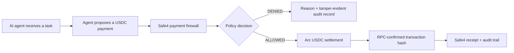
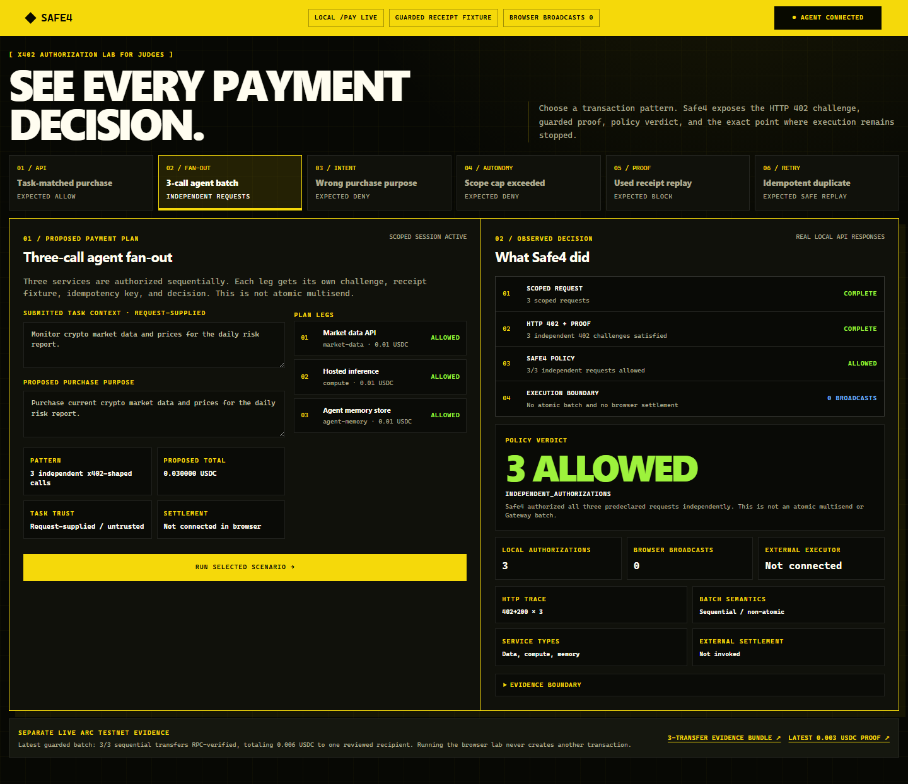

# Safe4 — an Arc payment firewall for AI agents

Safe4 sits between an AI agent's decision to pay and the execution of that
payment. It checks whether the payment is authorized, within policy, consistent
with submitted task context, and safe to settle before allowing USDC to move.

This is the public build repository for Safe4's Encode x Arc Programmable Money
Hackathon submission in the Agentic Economy track.

## Current verified status

As of 5 August 2026:

- the FastAPI payment-firewall service and its policy, approval, receipt, audit,
  AP2, x402, MCP-governance, and anomaly-control paths are implemented
- the prepared public repository passes 447 Python 3.13 tests plus 27 subtests
- an independently reviewed local edge-case run passed all 22 predeclared
  authorization scenarios and all eight settlement-verifier fixtures; all
  three adversarial intent/counterparty canaries were authorized and remain
  disclosed known gaps
- a real `0.01 USDC` transfer has settled on Arc Testnet and is independently
  verifiable by RPC
- the one-command golden path runs Safe4's real `/pay` authorization flow,
  shows one ALLOWED and one DENIED decision, and re-verifies the transaction
  through Arc RPC
- deterministic task-to-payment matching against request-supplied context
  changes the outcome for a same-amount, same-category, same-counterparty purchase
- x402 challenges advertise Arc Testnet first and map its recipient to the
  explicitly configured payment destination
- an authenticated Circle Agent Wallet settled `0.01` testnet USDC after
  Safe4 returned ALLOWED; the ERC-4337 receipt is RPC-verified
- an independently reviewed fixed batch authorized three local requests, then
  settled and RPC-verified three sequential Arc Testnet transfers totaling
  `0.006 USDC` to one reviewed recipient

The midpoint milestone was 27 July 2026. Integration runs 27–31 July,
proof runs 1–8 August, and final submission is due 9 August 2026; the exact
dashboard cutoff and timezone remain to be confirmed.

## Edge-case transaction evidence

The sanitized [edge-case evidence summary](artifacts/transaction-edge-cases/20260805T011517Z/summary.md)
records the exact observed status, reason codes, spend/log deltas, and known
gaps. Reproduce a new local-only run with:

```powershell
.\.python313\python.exe scripts\run_edge_case_evidence.py
.\.python313\python.exe scripts\validate_edge_case_evidence.py artifacts\transaction-edge-cases\<UTC-run-id>
```

These are local `/pay` authorization results and deterministic verifier
fixtures, not blockchain transactions. The run performed no RPC, wallet,
signing, transfer, or broadcast. Its independent verdict is
`PASS_WITH_KNOWN_GAPS`: C01-C03 show that the current deterministic matcher does
not prevent the tested intent laundering, spoofed purpose, or counterparty
substitution attacks.

## Run the golden path

Python **3.13** is required. After installing the repository dependencies, run:

```bash
bash scripts/demo_golden_path.sh
```

Stable output includes the task, purchase, amount, counterparty, checks,
ALLOWED/DENIED reasons, real Arc transaction hash and explorer URL, plus the
demo executor call count showing that this orchestrator did not invoke
settlement for the denied branch.

The default `RPC_VERIFIED_REPLAY` mode is safe and unattended. It verifies
existing real chain evidence and clearly states that it did not broadcast a
fresh transfer. It does not need `ARC_PRIVATE_KEY` or any wallet credential.

Optional fresh Circle Agent Wallet execution:

```powershell
$env:SAFE4_DEMO_MODE = "circle-live"
$env:SETTLEMENT_FROM = "0xYourAuthenticatedAgentWallet"
$env:SETTLEMENT_TO = "0xExplicitArcTestnetRecipient"
$env:SETTLEMENT_AMOUNT_UNITS = "10000"
$env:SETTLEMENT_IDEMPOTENCY_KEY = (New-Guid).Guid
powershell.exe -NoProfile -ExecutionPolicy Bypass -File scripts\demo_golden_path.ps1
```

That mode requires Circle CLI plus an authenticated Arc Testnet Agent Wallet
session. Circle's email OTP and Terms acceptance remain human-controlled. The
adapter reaches the transfer command only after ALLOWED. Preserve the generated
idempotency key if a failed response must be retried; never retry with a new key
when broadcast status is uncertain.

To re-verify the fresh Agent Wallet transaction without broadcasting again:

```bash
bash scripts/demo_circle_replay.sh
```

Windows without WSL:

```powershell
powershell.exe -NoProfile -ExecutionPolicy Bypass -File scripts\demo_circle_replay.ps1
```

- [Editable 10-slide deck](artifacts/Safe4_Encode_Arc_Deck.pptx)
- [Video script, run sheet, and rehearsal checklist](docs/hackathon/VIDEO_PACKAGE.md)
- [Claim ledger](docs/hackathon/CLAIM_LEDGER.md)
- [Arc challenges overcome and core-team suggestions](docs/hackathon/ARC_IMPLEMENTATION_CHALLENGES.md)

## Verified Arc transaction

| Field | Value |
|---|---|
| Network | Arc Testnet |
| Chain ID | `5042002` |
| USDC contract | `0x3600000000000000000000000000000000000000` |
| Amount | `0.01 USDC` |
| Transaction | [`0x24e9595078de0778428eea09af2a10ec53828c10aca6e4c5517ef1dd09144a7a`](https://testnet.arcscan.app/tx/0x24e9595078de0778428eea09af2a10ec53828c10aca6e4c5517ef1dd09144a7a) |
| Circle Agent Wallet transaction (28 July 2026) | [`0x648ef14e4da7c6bfecce0017d19280ed51fb12635bea94712de926d9f967752c`](https://testnet.arcscan.app/tx/0x648ef14e4da7c6bfecce0017d19280ed51fb12635bea94712de926d9f967752c) |
| Circle Agent Wallet transaction (5 August 2026) | [`0xf9d665cf0eb663e33703826ca599d526718042781860faeec5e7ad089fde775d`](https://testnet.arcscan.app/tx/0xf9d665cf0eb663e33703826ca599d526718042781860faeec5e7ad089fde775d) |

The repository includes an RPC verifier. Direct-transfer mode checks the chain,
token contract, sender, recipient, calldata, amount, receipt, and ERC-20
`Transfer` event. Circle Agent Wallet mode checks the successful ERC-4337
`UserOperationEvent` and the exact Arc native-USDC transfer event. See
[`docs/ARC_TESTNET_EVIDENCE.md`](docs/ARC_TESTNET_EVIDENCE.md).

## Architecture



Safe4 is the task-aware authorization and governance layer above wallet-native
spending controls. It combines the proposed payment with task intent, autonomy scope,
budgets, velocity, approval state, recipient signals, and auditable decision
evidence.

See [`docs/ARCHITECTURE.md`](docs/ARCHITECTURE.md) for the trust boundary and
the current settlement integration seam.

## Run locally

Python **3.13** is required.

### Windows PowerShell

```powershell
py -3.13 -m venv .venv
.\.venv\Scripts\python.exe -m pip install --upgrade pip
.\.venv\Scripts\python.exe -m pip install -r requirements-dev.txt -r requirements-arc.txt
.\.venv\Scripts\python.exe -m pytest -q -m "not slow"
.\.venv\Scripts\python.exe scripts\run_local_demo.py
```

### macOS or Linux

```bash
python3.13 -m venv .venv
.venv/bin/python -m pip install --upgrade pip
.venv/bin/python -m pip install -r requirements-dev.txt -r requirements-arc.txt
.venv/bin/python -m pytest -q -m "not slow"
.venv/bin/python scripts/run_local_demo.py
```

Open:

- x402 decision lab:
  <http://localhost:8090/demo/x402?access_token=safe4-local-demo>
- API documentation: <http://localhost:8090/docs>
- agent-security demo:
  <http://localhost:8090/demo/agent-security?access_token=safe4-local-demo>
- operator console:
  <http://localhost:8090/demo/console?access_token=safe4-local-demo>

The x402 decision lab connects a least-privilege demo agent and exercises six
predeclared scenarios through the real local `/pay` challenge/retry path:
task-matched purchase, three independent service authorizations, intent and
autonomy-scope denials, receipt replay, and idempotent retry. Its guarded
receipt is explicitly scaffolded; the browser does not receive a wallet key or
admin credential and does not broadcast a fresh transaction. The three-service
case is sequential and non-atomic, not a native multisend or Gateway batch.

Use the [judge demo runbook](docs/hackathon/JUDGE_DEMO_RUNBOOK.md) for a
90-second walkthrough and the exact evidence boundaries.



### Independently reviewed live batch evidence

The browser's evidence lane links to a separate historical
[`20260805T123013Z` bundle](artifacts/live-arc-batch/20260805T123013Z/README.md).
That bounded run recorded three sequential, non-atomic Arc Testnet USDC
transfers to one reviewed recipient after three local Safe4 `/pay`
authorizations:

| Demo item | Amount | Arc block | Transaction |
|---|---:|---:|---|
| Market data | 0.001 USDC | `55439625` | [`0x0f15…6145`](https://testnet.arcscan.app/tx/0x0f15d296afbefcd20c0b074c36f6ccc914020825af125c6f2e8b9af97a066145) |
| Compute | 0.002 USDC | `55439642` | [`0x29df…ce4d`](https://testnet.arcscan.app/tx/0x29df57bf6ca1520034f22b6137c9f027c2f7610aebb0067ff6784593665bce4d) |
| Agent memory | 0.003 USDC | `55439658` | [`0x80cb…4a27`](https://testnet.arcscan.app/tx/0x80cb6d59bcbdd9f25ab7bdd41816febd041cc6bb353c7216dddf6b3c7cfc4a27) |

The independent verdict was `PASS` for this bounded claim. The receipt route
was a local fixture and task context was request-supplied. This was not a
native multisend, Circle Gateway integration, or three paid external x402
endpoints, and it does not prove exactly-once external settlement. The verifier
did not decode complete UserOperation calldata, so it does not prove the
absence of unrelated non-USDC effects inside an operation.

The application defaults are for local development only. Production-like
deployments must provide explicit secrets, persistence, and recipient
configuration through environment variables.

## Run with Docker

```bash
docker compose up --build
```

Then open the x402 decision lab:
<http://localhost:8090/demo/x402?access_token=safe4-local-demo>.

`safe4-local-demo` and the other defaults in `scripts/run_local_demo.py` are
deliberately public, local-development values. Do not reuse them for a shared
or production-like deployment.

## Deploy on Railway

[`railway.json`](railway.json) pins the Dockerfile build, `python main.py`
start command, `/health` deployment gate, and on-failure restart policy.
The shared deployment must supply these values through Railway variables:

- `PAYMENT_FIREWALL_ENV=production`
- `PAYMENT_FIREWALL_POSTGRES_DSN=${{Postgres.DATABASE_URL}}`
- independently generated `PAYMENT_FIREWALL_ADMIN_SECRET`,
  `PAYMENT_FIREWALL_RECEIPT_SECRET`, and
  `PAYMENT_FIREWALL_DEMO_ACCESS_TOKEN`
- `PAYMENT_FIREWALL_DEMO_X402_RECEIPT_ENABLED=true`
- `PAYMENT_FIREWALL_PAY_TO=<Arc Testnet recipient>`
- `PAYMENT_FIREWALL_X402_SUPPORTED_NETWORKS=arc-testnet`
- `PAYMENT_FIREWALL_X402_NETWORK_RECIPIENTS=arc-testnet:<same recipient>`
- `PAYMENT_FIREWALL_PHASE3_X402_ADVANCED_ENABLED=true`
- `PAYMENT_FIREWALL_OAUTH_ISSUER=https://<generated Railway domain>`

Do not commit the generated secret values. A public deployment is not claimed
until its health, demo pages, and authorization flow have been checked at the
deployed URL.

## Tests

Fast development gate:

```bash
python -m pytest -q -m "not slow"
```

Full regression gate:

```bash
python -m pytest -q
```

## Private-key safety

`ARC_PRIVATE_KEY` must be supplied only through the local process environment.
Never paste it into an issue, pull request, command transcript, `.env` file, or
committed configuration. Verification of an existing transaction does not
require a private key.

The default demo and Circle Agent Wallet mode do not read `ARC_PRIVATE_KEY`.
Circle Agent Wallet credentials are managed by Circle CLI; never commit its
session data or expose an OTP.

## Repository scope

This public repository is a runnable hackathon build, not a dump of Safe4's
private product workspace. Internal research, operational state, submission
automation, local databases, credentials, and private deployment configuration
are deliberately excluded.

## License

No open-source license has been selected yet. Copyright remains with Safe4.
