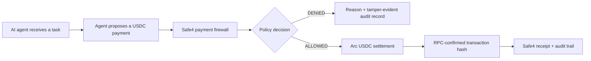

# Safe4 — an Arc payment firewall for AI agents

Safe4 sits between an AI agent's decision to pay and the execution of that
payment. It checks whether the payment is authorized, within policy, consistent
with submitted task context, and safe to settle before allowing USDC to move.

This is the public build repository for Safe4's Encode x Arc Programmable Money
Hackathon submission in the Agentic Economy track.

## Current verified status

As of 28 July 2026:

- the FastAPI payment-firewall service and its policy, approval, receipt, audit,
  AP2, x402, MCP-governance, and anomaly-control paths are implemented
- the Python 3.13 regression gate passes with 286 tests
- a real `0.01 USDC` transfer has settled on Arc Testnet and is independently
  verifiable by RPC
- the one-command golden path runs Safe4's real `/pay` authorization flow,
  shows one ALLOWED and one DENIED decision, and re-verifies the transaction
  through Arc RPC
- deterministic task-to-payment matching against request-supplied context changes the outcome for a
  same-amount, same-category, same-counterparty purchase
- x402 challenges advertise Arc Testnet first and map its recipient to the
  explicitly configured payment destination
- the optional Circle Agent Stack adapter is coded to attempt an Arc Testnet
  Agent Wallet transfer only after ALLOWED; authenticated validation is pending

The midpoint milestone was 27 July 2026. Integration runs 27–31 July,
proof runs 1–8 August, and final submission is due 9 August 2026; the exact
dashboard cutoff and timezone remain to be confirmed.

## Run the golden path

Python **3.13** is required. After installing the repository dependencies, run:

```bash
bash scripts/demo_golden_path.sh
```

Stable output includes the task, purchase, amount, counterparty, checks,
ALLOWED/DENIED reasons, real Arc transaction hash and explorer URL, plus the
demo executor call count showing that this orchestrator did not invoke
settlement for the denied branch.

The default `RPC_VERIFIED_REPLAY` mode is safe and unattended. It verifies
existing real chain evidence and clearly states that it did not broadcast a
fresh transfer. It does not need `ARC_PRIVATE_KEY` or any wallet credential.

Optional fresh Circle Agent Wallet execution:

```bash
SAFE4_DEMO_MODE=circle-live bash scripts/demo_golden_path.sh
```

That mode requires Circle CLI plus an authenticated Arc Testnet Agent Wallet
session. Circle's email OTP and Terms acceptance remain human-controlled. The
adapter is coded to reach the transfer command only after ALLOWED; a successful
authenticated Circle run is not yet claimed.

- [Editable 10-slide deck](artifacts/Safe4_Encode_Arc_Deck.pptx)
- [Video script, run sheet, and rehearsal checklist](docs/hackathon/VIDEO_PACKAGE.md)
- [Claim ledger](docs/hackathon/CLAIM_LEDGER.md)

## Verified Arc transaction

| Field | Value |
|---|---|
| Network | Arc Testnet |
| Chain ID | `5042002` |
| USDC contract | `0x3600000000000000000000000000000000000000` |
| Amount | `0.01 USDC` |
| Transaction | [`0x24e9595078de0778428eea09af2a10ec53828c10aca6e4c5517ef1dd09144a7a`](https://testnet.arcscan.app/tx/0x24e9595078de0778428eea09af2a10ec53828c10aca6e4c5517ef1dd09144a7a) |

The repository includes an RPC verifier that checks the chain, token contract,
sender, recipient, exact calldata and amount, successful receipt, and matching
ERC-20 `Transfer` event. See
[`docs/ARC_TESTNET_EVIDENCE.md`](docs/ARC_TESTNET_EVIDENCE.md).

## Architecture



Safe4 is the task-aware authorization and governance layer above wallet-native
spending controls. It combines the proposed payment with task intent, autonomy
scope, budgets, velocity, approval state, recipient signals, and auditable
decision evidence.

See [`docs/ARCHITECTURE.md`](docs/ARCHITECTURE.md) for the trust boundary and
the current settlement integration seam.

## Run locally

Python **3.13** is required.

### Windows PowerShell

```powershell
py -3.13 -m venv .venv
.\.venv\Scripts\python.exe -m pip install --upgrade pip
.\.venv\Scripts\python.exe -m pip install -r requirements-dev.txt -r requirements-arc.txt
.\.venv\Scripts\python.exe -m pytest -q -m "not slow"
.\.venv\Scripts\python.exe scripts\run_local_demo.py
```

### macOS or Linux

```bash
python3.13 -m venv .venv
.venv/bin/python -m pip install --upgrade pip
.venv/bin/python -m pip install -r requirements-dev.txt -r requirements-arc.txt
.venv/bin/python -m pytest -q -m "not slow"
.venv/bin/python scripts/run_local_demo.py
```

Open:

- API documentation: <http://localhost:8090/docs>
- agent-security demo:
  <http://localhost:8090/demo/agent-security?access_token=safe4-local-demo>
- operator console:
  <http://localhost:8090/demo/console?access_token=safe4-local-demo>

The application defaults are for local development only. Production-like
deployments must provide explicit secrets, persistence, and recipient
configuration through environment variables.

## Run with Docker

```bash
docker compose up --build
```

Then open
<http://localhost:8090/demo/agent-security?access_token=safe4-local-demo>.

`safe4-local-demo` and the other defaults in `scripts/run_local_demo.py` are
deliberately public, local-development values. Do not reuse them for a shared
or production-like deployment.

## Deploy on Railway

[`railway.json`](railway.json) pins the Dockerfile build, `python main.py`
start command, `/health` deployment gate, and on-failure restart policy.
The shared deployment must supply these values through Railway variables:

- `PAYMENT_FIREWALL_ENV=production`
- `PAYMENT_FIREWALL_POSTGRES_DSN=${{Postgres.DATABASE_URL}}`
- independently generated `PAYMENT_FIREWALL_ADMIN_SECRET`,
  `PAYMENT_FIREWALL_RECEIPT_SECRET`, and
  `PAYMENT_FIREWALL_DEMO_ACCESS_TOKEN`
- `PAYMENT_FIREWALL_PAY_TO=<Arc Testnet recipient>`
- `PAYMENT_FIREWALL_X402_SUPPORTED_NETWORKS=arc-testnet`
- `PAYMENT_FIREWALL_X402_NETWORK_RECIPIENTS=arc-testnet:<same recipient>`
- `PAYMENT_FIREWALL_OAUTH_ISSUER=https://<generated Railway domain>`

Do not commit the generated secret values. A public deployment is not claimed
until its health, demo pages, and authorization flow have been checked at the
deployed URL.

## Tests

Fast development gate:

```bash
python -m pytest -q -m "not slow"
```

Full regression gate:

```bash
python -m pytest -q
```

## Private-key safety

`ARC_PRIVATE_KEY` must be supplied only through the local process environment.
Never paste it into an issue, pull request, command transcript, `.env` file, or
committed configuration. Verification of an existing transaction does not
require a private key.

The default demo and Circle Agent Wallet mode do not read `ARC_PRIVATE_KEY`.
Circle Agent Wallet credentials are managed by Circle CLI; never commit its
session data or expose an OTP.

## Repository scope

This public repository is a runnable hackathon build, not a dump of Safe4's
private product workspace. Internal research, operational state, submission
automation, local databases, credentials, and private deployment configuration
are deliberately excluded.

## License

No open-source license has been selected yet. Copyright remains with Safe4.
