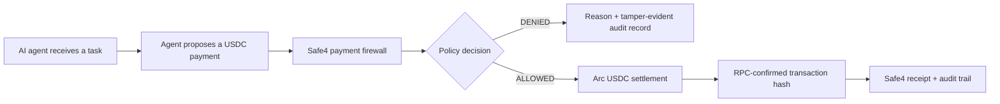

# Safe4 — an Arc payment firewall for AI agents

Safe4 sits between an AI agent's decision to pay and the execution of that
payment. It checks whether the payment is authorized, within policy, consistent
with the agent's task, and safe to settle before allowing USDC to move.

This is the public build repository for Safe4's Encode x Arc Programmable Money
Hackathon submission in the Agentic Economy track.

## Midpoint status

As of 28 July 2026:

- the FastAPI payment-firewall service and its policy, approval, receipt, audit,
  AP2, x402, MCP-governance, and anomaly-control paths are implemented
- the Python 3.13 regression gate passes with 270 tests
- a real `0.01 USDC` transfer has settled on Arc Testnet and is independently
  verifiable by RPC
- the standalone Arc sender never logs or persists its private key
- wiring RPC-confirmed Arc settlement into Safe4's x402 payment path is in
  progress
- semantic task-to-payment intent verification is in progress; the current
  keyword heuristic is not presented as semantic verification

The midpoint submission is due 2 August 2026. Final submission is due
22 August 2026.

## Verified Arc transaction

| Field | Value |
|---|---|
| Network | Arc Testnet |
| Chain ID | `5042002` |
| USDC contract | `0x3600000000000000000000000000000000000000` |
| Amount | `0.01 USDC` |
| Transaction | [`0x24e9595078de0778428eea09af2a10ec53828c10aca6e4c5517ef1dd09144a7a`](https://testnet.arcscan.app/tx/0x24e9595078de0778428eea09af2a10ec53828c10aca6e4c5517ef1dd09144a7a) |

The repository includes an RPC verifier that checks the chain, token contract,
sender, recipient, exact calldata and amount, successful receipt, and matching
ERC-20 `Transfer` event. See
[`docs/ARC_TESTNET_EVIDENCE.md`](docs/ARC_TESTNET_EVIDENCE.md).

## Architecture



Safe4 is the reasoning and governance layer above wallet-native spending
controls. It combines the proposed payment with task intent, autonomy scope,
budgets, velocity, approval state, recipient signals, and auditable decision
evidence.

See [`docs/ARCHITECTURE.md`](docs/ARCHITECTURE.md) for the trust boundary and
the current settlement integration seam.

## Run locally

Python **3.13** is required.

### Windows PowerShell

```powershell
py -3.13 -m venv .venv
.\.venv\Scripts\python.exe -m pip install --upgrade pip
.\.venv\Scripts\python.exe -m pip install -r requirements-dev.txt -r requirements-arc.txt
.\.venv\Scripts\python.exe -m pytest -q -m "not slow"
.\.venv\Scripts\python.exe scripts\run_local_demo.py
```

### macOS or Linux

```bash
python3.13 -m venv .venv
.venv/bin/python -m pip install --upgrade pip
.venv/bin/python -m pip install -r requirements-dev.txt -r requirements-arc.txt
.venv/bin/python -m pytest -q -m "not slow"
.venv/bin/python scripts/run_local_demo.py
```

Open:

- API documentation: <http://localhost:8090/docs>
- agent-security demo:
  <http://localhost:8090/demo/agent-security?access_token=safe4-local-demo>
- operator console:
  <http://localhost:8090/demo/console?access_token=safe4-local-demo>

The application defaults are for local development only. Production-like
deployments must provide explicit secrets, persistence, and recipient
configuration through environment variables.

## Run with Docker

```bash
docker compose up --build
```

Then open
<http://localhost:8090/demo/agent-security?access_token=safe4-local-demo>.

`safe4-local-demo` and the other defaults in `scripts/run_local_demo.py` are
deliberately public, local-development values. Do not reuse them for a shared
or production-like deployment.

## Tests

Fast development gate:

```bash
python -m pytest -q -m "not slow"
```

Full regression gate:

```bash
python -m pytest -q
```

## Private-key safety

`ARC_PRIVATE_KEY` must be supplied only through the local process environment.
Never paste it into an issue, pull request, command transcript, `.env` file, or
committed configuration. Verification of an existing transaction does not
require a private key.

## Repository scope

This public repository is a runnable hackathon build, not a dump of Safe4's
private product workspace. Internal research, operational state, submission
automation, local databases, credentials, and private deployment configuration
are deliberately excluded.

## License

No open-source license has been selected yet. Copyright remains with Safe4.
